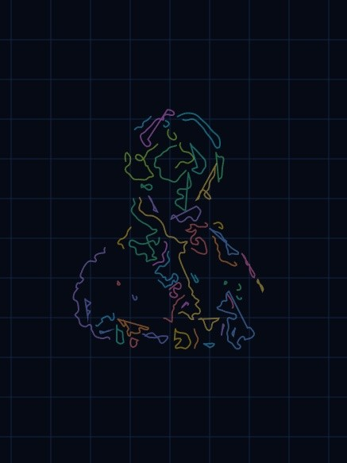

# FouriTre (フーリトレ)

FouriTreは、描いた線やインポートした画像を「フーリエ変換」し、回転する円（エピサイクル）の連鎖で再現するインタラクティブ数学ビジュアライザです。

## 🚀 特徴

### 1. 多彩なインポート機能
- **自由描画**: キャンバス上にマウスやタッチで描いたストロークを即座にエピサイクル化します。
- **画像インポート**: 画像を読み込み、エッジ検出を行って描画パスを生成します。コントラスト強調とグレースケール化のプリセット処理により、鮮明な輪郭抽出が可能です。
- **テキスト変換**: 好きなフォントや絵文字を入力してパスに変換できます。複数行にも対応しています。

  
  

### 2. 高度な編集・操作
- **オブジェクト操作**: 描画したオブジェクトの移動、削除、コピー＆ペーストが可能です。
- **クリップボード・プレビュー**: コピーした内容はサムネイルで確認でき、連続してペーストも行えます。
- **Undo/Redo**: 30ステップまでの履歴管理に対応。

### 3. ビジュアライズ・オプション
- **エピサイクル制御**: 円の数（最大2000個）やアニメーション速度を細かく調整可能。
- **描画モード**: 虹色トレース、残像表示、ミラー（鏡像）表示、漸出（Reveal）モードなど。
- **外観カスタマイズ**: 背景色、グリッドの色、トレースの色などを自由に変更。

### 4. モバイル・タブレット最適化
- タッチ操作に最適化されたUI。
- 画面幅に合わせたレスポンシブなコントロールパネル。削除などの重要ボタンも隠れず、快適に操作できます。

### 5. エクスポート
- 画像（PNG / 背景透過PNG / JPEG）
- 動画（WebM形式）
- プロジェクト保存（JSON形式）

## 🛠 技術スタック
- **Language**: JavaScript (Vanilla JS)
- **Rendering**: HTML5 Canvas API
- **Deployment**: Vercel

## 📖 使い方
1. **描画**: 「描画」タブでキャンバスに線を引きます。
2. **変換**: 「インポート」または「テキスト」タブから複雑な図形を取り込みます。
3. **調整**: 円の数や速度スライダーを動かして、数学的な軌跡を楽しみます。
4. **保存**: 気に入ったアニメーションは画像や動画として書き出せます。

## 👤 開発者
- **Ike mfr** (Takumu Ikenaga)

## 📄 ライセンス
MIT License
